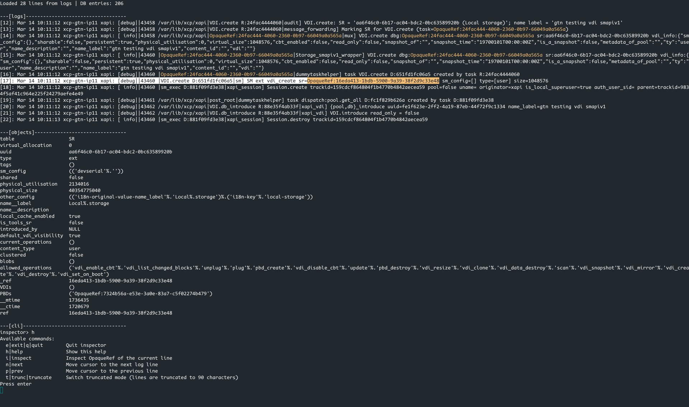

# Inspector

Inspector is a small terminal tool to help read and understand **XAPI logs**.
It loads a log file and the XAPI database state, then lets you navigate inside
the logs and inspect objects referenced by the logs.

The goal is to make post‑mortem debugging easier when logs contain many
`OpaqueRef` and UUID identifiers.

The interface is simple and runs entirely in the terminal.

---

## Features

- Load a XAPI log file
- Load a XAPI database dump (XML)
- Navigate inside the log with a cursor
- Highlight `OpaqueRef` identifiers in the logs
- Toggle log truncation
- Inspector panel for future object inspection

---

## Run

Example:

```sh
dune exec ./bin/main.exe -- -log inputs/xensource.log -db inputs/state.xml
```

---

## Screenshot



---

## Commands

- **Key**: press the key directly
- **Command**: enter a command after pressing ':'
  
|   Key    | Command |           Description            |
|----------|---------|----------------------------------|
| `<Down>` | `next`  | Move cursor to next log line     |
| `<Up>`   | `prev`  | Move cursor to previous log line |
| `t`      | `trunc` | Toggle truncated log display     |
| `h`      | `help`  | Show help                        |
| `q`      | `quit`  | Quit inspector                   |

---

## How it works

1. The log file is loaded into memory.
2. The XAPI database XML is parsed.
3. The terminal shows:
   - a **log window**
   - an **objects panel**
   - a **command prompt**
4. The cursor moves inside the logs and identifiers are highlighted.

Next steps of the project will allow inspecting objects referenced in the logs.

---

## Project structure

### Architecture
```
Domain (model)
  logs
  cursor
  XAPI database

UI (view state)
  truncated
  objects list
  object scroll
  last command

Repl (controller)
  commands
  rendering
```

```
bin/
  main.ml

lib/
  inspect.ml
  domain.ml
  repl.ml
  style.ml
  ui.ml
  xapidb.ml
```

- **inspect**: identifier detection and highlighting
- **domain**: domain state (logs, cursor, database)
- **repl**: command loop and rendering
- **style**: Ansi escape sequence to manage output
- **ui**: UI state (truncation, inspector panel)
- **xapidb**: parsing the XAPI database

---

## Status

This project is experimental and under development.
